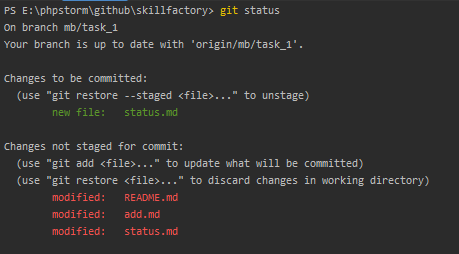

# git status #

## Что делает ##
Показывает состояния файлов в рабочем каталоге и индексе: 
какие файлы изменены, но не добавлены в индекс; 
какие ожидают коммита в индексе.
Вдобавок к этому выводятся подсказки о том, как изменить состояние файлов.
***

## Пример ##
```
git status
```


